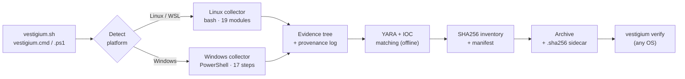
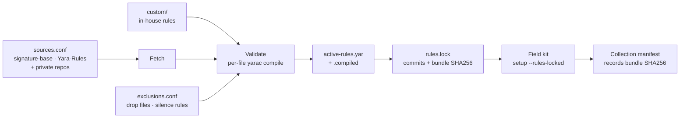

<div align="center">

# Vestigium

**Cross-platform live-response evidence collection for Linux and Windows**

*vestigium* (Latin): footprint, trace. It is the root of *investigate*, "to follow the tracks".

[](https://github.com/parthabishwas/vestigium/actions/workflows/tests.yml)
[](https://github.com/parthabishwas/vestigium/actions/workflows/yara-rules.yml)


[](LICENSE)

[Quick start](#quick-start) ·
[How it works](#how-it-works) ·
[Usage](#usage) ·
[Evidence](#evidence-output) ·
[YARA rules](#yara-rules-updates-and-maintenance) ·
[Data handling](#data-handling) ·
[Author](#author)

</div>

---

Vestigium turns a live Linux or Windows endpoint into a **self-verifying
evidence package**. The package holds:

- a timestamped evidence tree
- a provenance record for every copied file
- a SHA256 inventory
- a JSON manifest
- a single archive with its own SHA256 sidecar

You use one kit, one entry point and one evidence contract for both operating
systems.

It is built for incident responders and security teams who have to answer the
first questions of an investigation quickly and defensibly: *what ran, what
persists, who logged in, what talked to the network, what arrived on disk,
and was anything tampered with*. It does this without installing anything on
the host and without making a single outbound connection during collection.

## Highlights

| | |
|---|---|
| **One entry point** | `vestigium.sh` (Linux, WSL, Git Bash) and `vestigium.cmd` / `vestigium.ps1` (Windows) detect the platform and translate the same options for the native collector. |
| **Forensically careful** | Order of volatility (optional RAM capture first). Source timestamps are recorded *before* every copy. setuid bits are neutralised in copies. Nothing is installed on the host. No DNS lookups or outbound traffic. |
| **Verifiable by design** | SHA256 for every file, plus a manifest of what ran and what was acquired. `vestigium verify` checks Linux and Windows packages from either OS and refuses tampered, truncated or malicious archives. |
| **Survives interruption** | Ctrl+C, SIGTERM or a dropped SSH session still produce a hashed, manifested, clearly marked `_INCOMPLETE` package. |
| **Broad coverage** | Processes, network, persistence (systemd, cron, Run keys, WMI, tasks), logs and EVTX, browsers and extensions, users, execution history (Prefetch, Amcache, SRUM), devices, containers, integrity checks, memory. Windows also acquires $MFT / USN journal / hives via VSS, LNK & Jump Lists, Recycle Bin and Defender MPLog; Linux adds journal-sealing, container-layer drift and in-memory shell-history recovery. |
| **Detection built in** | YARA scanning with a curated, compile-validated rule bundle (signature-base and Yara-Rules plus your own rules) and offline IOC matching. The scanner never scans itself. |
| **One findings report** | Both platforms emit the same `findings.json` and a self-contained, offline `findings.html` at the evidence root: severity-ranked triage leads with links to the raw artifacts. |
| **Trusted-binary mode** (Linux) | `--trusted-tools` forces the kit's own binaries over the host's and cross-checks `ps`/`ss`/`lsmod`/`ls` against `/proc` and `/sys` to expose hidden processes, modules, ports and files on a compromised host. |
| **Explicit data policy** | Browser credential stores are copied on both platforms, as evidence for credential-theft investigations, or recorded as metadata only with one switch. The policy is written into every manifest. The kit is hardened against being attacked from the compromised host it runs on. |
| **Air-gap ready** | `setup` stages every helper tool, AVML and the rule bundle into the kit. The collection host needs no internet access. |

## Quick start

```bash
git clone https://github.com/parthabishwas/vestigium.git
cd vestigium
sudo ./vestigium.sh setup          # once, on a staging machine with internet access
```

Copy the whole folder to removable media, then on the host under investigation:

<table>
<tr><th>Linux</th><th>Windows (elevated prompt)</th></tr>
<tr><td>

```bash
sudo ./vestigium.sh --case-id IR-2026-014 \
     --output /media/evidence

./vestigium.sh verify \
     /media/evidence/<host>_<timestamp>.tar.zst
```

</td><td>

```bat
vestigium.cmd -CaseId IR-2026-014 ^
  -OutputPath E:\Evidence

vestigium.cmd verify ^
  E:\Evidence\<HOST>_<timestamp>.zip
```

</td></tr>
</table>

A bare run (`sudo ./vestigium.sh`) performs a full collection with an
auto-generated case ID.

## How it works



| You are in | Run | Result |
|---|---|---|
| Linux shell (incl. WSL) | `./vestigium.sh` | Linux collector (re-runs itself through `sudo` when needed) |
| Git Bash / MSYS2 / Cygwin | `./vestigium.sh` | Windows collector through `powershell.exe` |
| cmd.exe / Explorer | `vestigium.cmd` | `vestigium.ps1` with a process-scoped execution-policy bypass |
| PowerShell 5.1 / 7 | `.\vestigium.ps1` | The matching collector for the OS |

No single file can run natively under both `sh` and `cmd.exe`, so the entry
point is written in each shell's language and all three behave the same.
`--dry-run` / `-DryRun` shows the exact translated collector command without
running it.

## Supported platforms

| Platform | Status |
|---|---|
| Ubuntu 24.04 / 22.04 LTS, Debian 12 | Primary target |
| Other systemd Linux distributions | Best effort (dpkg-based integrity checks unavailable) |
| Windows 10 / 11, Windows Server 2016+ | Supported (Windows PowerShell 5.1 or PowerShell 7) |
| WSL | Collects the WSL environment; use `--platform windows` for the host |
| macOS | Detected and refused for collection; `verify` works |

## Usage

### Commands

| Command | Purpose |
|---|---|
| `collect` *(default)* | Run a live-response collection |
| `verify <package>` | Verify a folder, a Linux `.tar.zst` / `.tar.gz` or a Windows `.zip` |
| `setup` | Stage helper tools, AVML and the YARA rule bundle (`setup --verify` only reports) |
| `info` | Detected platform, toolkit readiness, free space |
| `version`, `help` | |

### Common options

Both spellings work in every launcher. Anything else is passed through to the
native collector.

| GNU style | PowerShell style | Meaning |
|---|---|---|
| `--case-id ID` | `-CaseId ID` | Case reference recorded in the manifest |
| `--target-user U` | `-TargetUser U1,U2` | Limit user-scoped collection to these profiles |
| `--output DIR` | `-OutputPath DIR` | Evidence base directory (default: `output/`) |
| `--modules A,B` / `--list-modules` | `-Modules A,B` / `-ListModules` | Run or list a subset of modules |
| `--quick` | `-Quick` | Fast triage |
| `--skip-yara` / `--yara-quick` | `-SkipYara` / `-YaraQuickScan` | No YARA, or high-signal paths only |
| `--yara-threads N` / `--yara-timeout S` | `-YaraThreads N` / `-YaraTimeoutSeconds S` | Scanner tuning |
| `--memory` | `-CaptureMemory` | Image physical RAM **first** (AVML / winpmem) |
| `--trusted-tools` | *(Linux only)* | Force kit binaries over the host's and cross-check against the kernel (see below) |
| `--no-archive` | `-NoArchive` | Leave the evidence folder uncompressed |
| `--credential-stores M` | `-BrowserCredentialStores M` | Browser credential stores: `copy` (default) or `metadata` |
| `-v`, `--verbose` | `-Verbose` | Verbose progress output |

<details>
<summary><b>More examples</b></summary>

```bash
sudo ./vestigium.sh --case-id IR-7 --target-user j.doe          # one suspect profile
sudo ./vestigium.sh --quick --skip-yara                         # minutes, not hours
sudo ./vestigium.sh --modules Processes,Network,Persistence     # targeted
sudo ./vestigium.sh --memory --output /media/evidence           # RAM first, off-host output
sudo ./vestigium.sh --rootkit-scan --yara-procs                 # deeper Linux checks
./vestigium.sh --platform windows --dry-run --case-id IR-7      # show the Windows command line
```

```powershell
.\vestigium.ps1 -CaseId IR-7 -TargetUser "CORP\j.doe" -BrowserCredentialStores MetadataOnly
.\vestigium.ps1 -CaptureMemory -OutputPath E:\Evidence -Elevate
.\vestigium.ps1 -ListModules
```

Full collector references: [Linux](platforms/linux/README.md) ·
[Windows](platforms/windows/README.md)

</details>

## Evidence output

| | Linux | Windows |
|---|---|---|
| Evidence tree | `<host>_<YYYYmmdd_HHMMSS>/` `01_System` ... `21_Manifest` | `<HOST>_<user>_<YYYYmmdd_HHMMSS>\` `01_System` ... `20_Memory` |
| Archive | `.tar.zst` (or `.tar.gz`) plus `.sha256` | `.zip` plus `.sha256` |
| Hash inventory | `20_Hashes/SHA256SUMS.txt` (`sha256sum -c` ready) | `15_Hashes\SHA256.csv` |
| Commands and provenance | `19_CollectionLogs/command-log.csv`, `provenance.csv` | `14_Logs\CommandLog.csv`, `Provenance.csv` |
| Manifest | `21_Manifest/manifest.json`, `summary.txt` | `16_Manifest\Manifest.json` |
| Findings report | `findings.json` + `findings.html` (evidence root) | `findings.json` + `findings.html` (evidence root) |
| Read first | `findings.html`, then `*/SUMMARY.txt` | `findings.html`, then `19_Triage\Findings.md` |

<details>
<summary><b>What is collected</b></summary>

**Linux**
- **System and processes:** host identity, per-process binary hashes and
  package owners.
- **Process anomalies:** deleted binaries, memfd, `LD_PRELOAD`.
- **Network:** sockets mapped to binaries, firewall rules, VPN and proxy
  settings.
- **Persistence:** systemd, cron, rc, PAM, udev, kernel modules, loader
  configuration.
- **Logs and logins:** the journal, `/var/log`, `wtmp`/`btmp`.
- **Browsers:** extensions, preferences, native messaging hosts, history.
- **Users:** history files, SSH trust relationships, credential-file
  inventory.
- **Integrity:** `dpkg --verify`, `debsums`, unpackaged binaries.
- **Filesystem:** SUID/SGID and capability sweeps across every local mount,
  and timelines.
- **Containers, memory and detection:** container state, optional AVML
  memory image, YARA and IOC matches.

**Windows**
- **System and processes:** asset information, processes, services, drivers.
- **Persistence:** registry autoruns (per-user hives, including logged-on
  users), Autoruns with signatures, WMI subscriptions, scheduled task XML.
- **Network:** connections and configuration.
- **Browsers:** extensions and profile data.
- **Event logs:** 19 EVTX channels.
- **Security products:** Defender state and exclusions, vendor antivirus logs
  with string carving.
- **Execution history:** Prefetch, Amcache, SRUM, ShimCache, PowerShell
  history.
- **Devices:** USB and volume history.
- **Memory and detection:** optional winpmem memory image, YARA, and a triage
  summary.

</details>

### Triage findings

Every collection ends by writing two files at the evidence root:

- **`findings.json`** — severity-ranked triage findings in a documented schema
  (`vestigium/findings/1`, see [docs/FINDINGS-SCHEMA.md](docs/FINDINGS-SCHEMA.md)),
  ready for SIEM or ticketing.
- **`findings.html`** — a self-contained, offline view of the same data: filter
  by severity, search, and open each finding's source artifact. No network, no
  external files.

Both platforms feed the one report UI, so a package reads the same whoever
produced it. Findings are **leads to prioritise review, not verdicts**; each one
links to the raw artifact it came from, and `vestigium verify` prints the
critical and high findings.

### Trusted-binary mode (Linux)

On a host that may be compromised, its own `ps`, `ss`, `ls`, `netstat` and
`lsmod` cannot be trusted. `--trusted-tools`:

- runs the kit's statically-staged binaries instead of the host's, and records
  which binary produced the evidence (path, source, SHA256) in
  `19_CollectionLogs/tool-provenance.csv`; and
- cross-checks the host's tools against the kernel's own view read straight
  from `/proc` and `/sys`, using the kit's static busybox as a third opinion,
  to expose hidden processes, kernel modules, listening ports and files.

The anti-rootkit cross-checks run on every collection (evidence in
`12_Security/antirootkit/`); discrepancies become `critical`/`high` findings.
Full details: **[docs/TRUSTED-MODE.md](docs/TRUSTED-MODE.md)**.

## Verification

```bash
./vestigium.sh verify output/web01_20260911_101500.tar.zst    # a Linux package
./vestigium.sh verify output/WS01_20260911_101500.zip         # a Windows package, from Linux
```

Both verifiers (Bash and PowerShell) read both formats. Each one:

- checks the archive sidecar and recomputes every recorded hash
- flags missing and unrecorded files
- treats an empty or malformed inventory as a failure
- checks memory-image sidecars
- refuses path-traversal archive entries

Exit code `0` means verified, `1` an integrity failure, `2` an unreadable
package.

## YARA rules: updates and maintenance

Vestigium never ships a frozen rule set. Rules come from maintained upstream
repositories plus your own. They are compile-validated into one bundle,
pinned in a lock file for reproducibility, and refreshed by a weekly CI job
that proposes updates for review.



| File (in `shared/yara-rules/`) | Versioned | Purpose |
|---|---|---|
| `sources.conf` | Yes | Rule repositories (name, git URL, optional branch/tag/commit). Add in-house or private repos here. |
| `custom/` | Yes | Your own rules. Always included first and compile-validated like the rest. |
| `exclusions.conf` | Yes | Tuning without forking upstream. `file:<glob>` drops files; `rule:<name>` silences a rule (it becomes `private`, so dependants keep working). |
| `rules.lock` | Yes | The exact upstream commits, rule count and bundle SHA256 of the last vetted build. |
| upstream clones, `active-rules.yar`, `.compiled`, reports | **No** | Built locally by `setup`, because the upstream licences (DRL 1.1, GPL-2.0) are not redistributed here. |

**Day to day**

```bash
sudo ./vestigium.sh setup --rules-only                     # track latest upstream, rebuild, rewrite rules.lock
sudo ./vestigium.sh setup --rules-locked                   # rebuild exactly the vetted commits in rules.lock
sudo ./vestigium.sh setup --rules-only --fp-corpus /usr/bin   # also report rules firing on known-clean files
./vestigium.sh setup --verify                              # sources, lock status, bundle age
```

```powershell
.\vestigium.ps1 setup                     # Windows: rebuild the shared bundle (validated with yarac64.exe when present)
.\vestigium.ps1 setup -Locked             # reproduce the locked build
```

**How the bundle stays healthy**

1. **Validation.** Each rule file is compiled on its own and dropped if it
   fails. The following are skipped:
   - include wrappers
   - duplicate identifiers
   - signature-base rules that need LOKI/THOR external variables

   The assembled bundle is compiled again, and it replaces the old one only
   when that succeeds. A broken upstream commit can never break the kit.
2. **Weekly CI** ([`yara-rules.yml`](.github/workflows/yara-rules.yml)).
   Every week the workflow:
   - fetches the latest upstream
   - builds and validates the bundle
   - runs a false-positive check on a clean corpus
   - opens a pull request updating `rules.lock`, with the build report and
     rule-count delta attached

   Maintainers review and merge; field kits then run `setup --rules-locked`.
3. **Traceability.** Every collection manifest records the SHA256 of the bundle
   it scanned with, so a finding can always be tied to an exact rule set.
4. **Tuning.** Noisy capability rules (crypto constants, packer heuristics)
   are listed in `exclusions.conf` as ready-to-enable suggestions. Detection
   stays complete by default.

The full lifecycle is in **[docs/YARA-RULES.md](docs/YARA-RULES.md)**. It
covers private repositories, air-gapped kits, the compiled-bundle version
caveat and licensing.

## Data handling

| Data | Linux | Windows |
|---|---|---|
| Browser passwords, cookies, autofill | Copied by default, with their metadata; `--credential-stores metadata` records metadata only | Copied by default; `-BrowserCredentialStores MetadataOnly` records metadata and redacts the `Local State` keys |
| Browser session / tab-restore stores | Metadata only; `--browser-sessions` to collect | n/a |
| Browsing history, bookmarks, extensions | Collected (`--no-browser-history` to skip) | Collected |
| Private SSH keys | Fingerprint and metadata only | n/a |
| `/etc/shadow` | Collected (account tampering is in scope) | n/a |

> [!IMPORTANT]
> A default package **contains live credential material**:
>
> - Firefox `logins.json` and `key4.db` decrypt offline unless the user set a
>   Primary Password.
> - Firefox cookies are stored in plaintext.
> - Chromium on Linux without a keyring uses a fixed, public key.
>
> Encrypt packages for transport. Where engagement rules forbid handling
> credentials, use `--credential-stores metadata`
> (`-BrowserCredentialStores MetadataOnly` on Windows). Details are in
> **[docs/DATA-HANDLING.md](docs/DATA-HANDLING.md)**.

Evidence folders are created mode `700` and archives mode `600` on Linux.
setuid and setgid bits are stripped from copies, and the original modes are
kept in the provenance log.

## Operational guidance

- **Write evidence off the system disk** (`--output /media/evidence`). The
  collector warns when you don't.
- **Run the kit from removable media**, not from a user profile that YARA
  scans. The kit and output are excluded from scans either way. Add an
  antivirus exclusion for the kit where policy allows: engines have been
  observed quarantining the rule corpus mid-collection.
- **Live response changes the host.** Processes run, and access times change
  on non-`relatime` mounts. Original timestamps are captured before every
  copy. Image the disk separately when you need a full forensic copy.
- **Interrupting is safe.** The first Ctrl+C finalises a partial,
  hashed package; a second one aborts.

## Project layout

```text
vestigium/
├── vestigium.sh / .ps1 / .cmd   entry points (platform detection, option translation)
├── VERSION                      single version source
├── platforms/
│   ├── linux/                   vestigium-linux.sh · modules/ · tools/ (setup, helpers)
│   └── windows/                 vestigium-windows.ps1 · Modules/ · Tools/ (rule builder, your .exe tools)
├── shared/
│   ├── yara-rules/              sources.conf · exclusions.conf · custom/ · rules.lock
│   ├── verify-evidence.sh       verifier (Bash)
│   └── Verify-Evidence.ps1      verifier (PowerShell)
├── docs/                        YARA-RULES.md · DATA-HANDLING.md · FINDINGS-SCHEMA.md · TRUSTED-MODE.md · WINDOWS-ARTIFACTS.md · history/
│   shared/report/                findings-template.html (the shared report UI)
├── tests/                       offline test suite
├── .github/workflows/           tests · weekly YARA rule refresh
└── output/                      default evidence location (git-ignored)
```

## Testing and CI

```bash
tests/run-tests.sh
```

The offline suite collects nothing from the host. It covers:

- shellcheck, the PowerShell parser, and ASCII/CRLF source checks
- a static check for leaked boolean results in the Windows modules
- launcher translation in dry-run mode
- collector argument validation, including shell-injection attempts
- both verifiers against clean, tampered, corrupted, malformed and
  path-traversal packages
- the YARA builder

On every push, CI also runs a **real collection and verification** on an
Ubuntu runner and on a Windows runner with Windows PowerShell 5.1.

## Roadmap

- macOS collector
- Optional encryption of evidence archives for transport (age / GPG)
- Optional export of timelines to Timesketch
- Signed releases with a pre-staged offline kit

Done in 2.0: a unified findings report on both platforms
([docs/FINDINGS-SCHEMA.md](docs/FINDINGS-SCHEMA.md)) and Linux trusted-binary
mode with host-vs-kernel anti-rootkit cross-checks
([docs/TRUSTED-MODE.md](docs/TRUSTED-MODE.md)).

Ideas and pull requests are welcome; see [CONTRIBUTING.md](CONTRIBUTING.md).

## Author

<table>
<tr>
<td>

**Partha Bishwas**
Offensive Application Security Engineer · Senior Security Engineer at BRAC IT Services Ltd.

Over ten years in offensive security:

- **Assessments:** web, mobile and API VAPT, business-logic abuse and secure
  architecture review for banking, fintech, government and telecom
  organisations. More than 200 applications tested and more than 100 critical
  vulnerabilities reported.
- **Research:** reverse engineering and malware analysis, and AI-augmented
  offensive testing.
- **Disclosure:** an active researcher on the major coordinated-disclosure
  platforms.

CEH v11 · M.Sc. Computer Science (Jahangirnagar University)

[](https://parthabishwas.com/)
[](https://www.linkedin.com/in/parthabishwas/)
[](https://twitter.com/parthabishwas)
[](mailto:info@parthabishwas.com)
<br/>
[](https://hackerone.com/parthabishwas)
[](https://bugcrowd.com/h/parthabishwas)
[](https://app.intigriti.com/profile/parthabishwas)
[](https://hackenproof.com/hackers/parthabishwas)

</td>
</tr>
</table>

## License

Vestigium is released under the [MIT License](LICENSE).

YARA rule repositories fetched by `setup` keep their own licences:
[Neo23x0/signature-base](https://github.com/Neo23x0/signature-base) uses the
Detection Rule License 1.1, and [Yara-Rules/rules](https://github.com/Yara-Rules/rules)
uses GPL-2.0. They are downloaded at setup time and are not part of this
repository. AVML (MIT, Microsoft), YARA, Sysinternals Autoruns and winpmem are
distributed under their own terms.

## Disclaimer

Vestigium is intended for **authorised** incident response, forensic and
security work on systems you own or are explicitly permitted to examine.
Live collection gathers sensitive personal and organisational data. Handle
evidence according to your legal, contractual and privacy obligations. The
software is provided "as is", without warranty of any kind.

<div align="center">
<sub>Built for responders who need the truth about a host, fast, and need to prove it.</sub>
</div>
